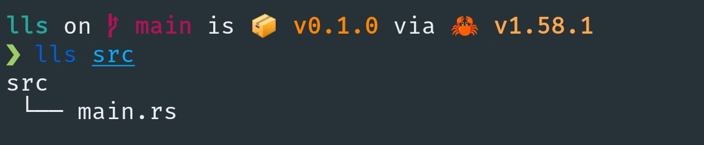
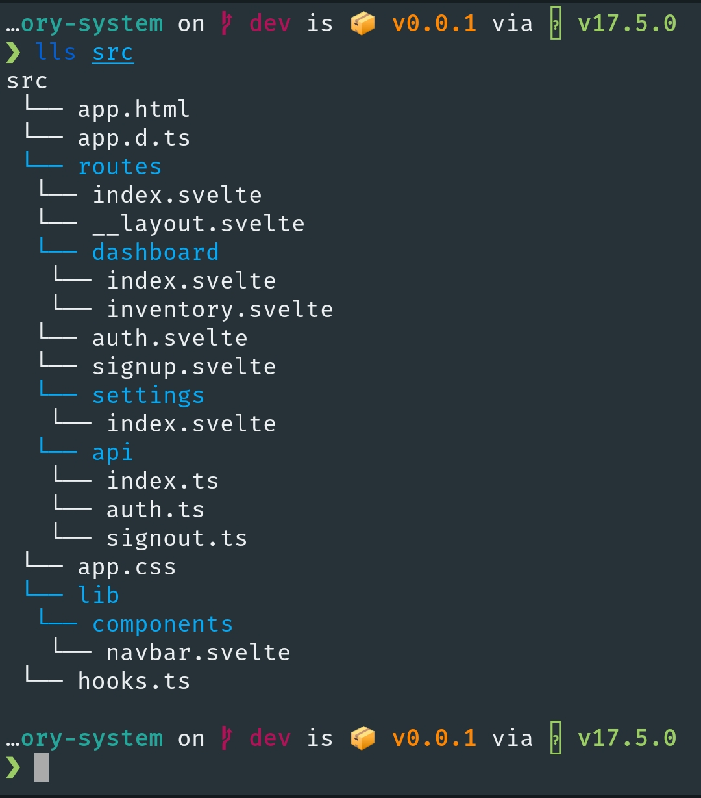

<h1 align="center">tree clone</h1>

## tree clone using rust

### I'm bored so, I made a clone for the tree command.

[clap version](https://github.com/mystique09/lls-clap)

### Usage:
```terminal
$ lls <option> <path>

Option:
  -a: include all hidden files and folders.
  -h, --h: display this message
```

### Sample #1


### Sample #2

